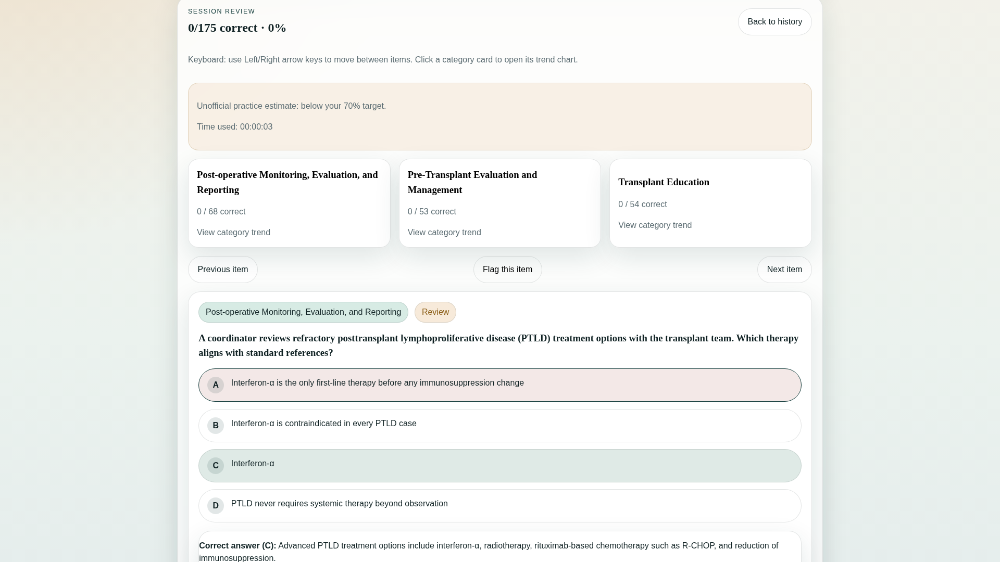

# CCTC Practice Exam

A client-side practice-exam web app for the ABTC **Certified Clinical Transplant Coordinator (CCTC®)** exam. Built from `ai-repo-template`; the app is intended to be implemented by an AI agent reading the prompts in `.github/prompts/`.

> **Independent study aid.** This practice app is **not affiliated with or endorsed by ABTC or PSI** and does not reproduce real exam questions. All items are original, written to the published content outline. Practice scores are estimates, not official results.

## Demo

<p align="center">
  <a href="https://github.com/user-attachments/assets/d19c9263-8a82-4114-b34e-c73011d04d43">
    
  </a>
</p>

<p align="center">
  <video src="https://github.com/user-attachments/assets/d19c9263-8a82-4114-b34e-c73011d04d43" controls muted playsinline loop autoplay width="960"></video>
</p>

<p align="center"><a href="https://github.com/user-attachments/assets/d19c9263-8a82-4114-b34e-c73011d04d43">Open the overview demo video</a></p>

## What it does

- Timed or untimed practice exams; timer defaults to the real exam's **180 minutes**, user-adjustable.
- User-set question count (defaults to the real exam's **175 items**).
- Two modes: **Study/flashcard** (answer + explanation revealed immediately) and **Exam** (results only after Submit).
- Both ABTC item formats: single-best-answer and complex multiple-choice.
- **Both blueprint versions**: the current outline (effective 2026-07-01) and the legacy outline (effective until 2026-06-30), selectable per session.
- Blueprint-weighted sampling, randomized question + answer order, recently-seen de-prioritization.
- **Save-after-each-question with resume.** Score history with per-content-category breakdown.
- Responsive (phone/tablet/laptop), client-side only (IndexedDB), static-hostable, offline after first load.

<details>
<summary>More feature demos</summary>

### Practice setup

<p align="center">
  <video src="https://github.com/user-attachments/assets/db0c00d6-529c-458c-ad7b-e822d09f360a" controls muted playsinline width="960"></video>
</p>

### Study mode

<p align="center">
  <video src="https://github.com/user-attachments/assets/ded2bd23-33ed-43b3-bf56-8daf0ce8c9f6" controls muted playsinline width="960"></video>
</p>

### Exam navigation and flagging

<p align="center">
  <video src="https://github.com/user-attachments/assets/58fcdee7-0a9e-43f1-8226-8e007c7d4b4f" controls muted playsinline width="960"></video>
</p>

### Score and history

<p align="center">
  <video src="https://github.com/user-attachments/assets/0fea0fcf-0352-4bcb-b62b-5761f3be3bfc" controls muted playsinline width="960"></video>
</p>

### Resume session

<p align="center">
  <video src="https://github.com/user-attachments/assets/d8d6711f-6bf5-437a-b357-de40c1ad68dd" controls muted playsinline width="960"></video>
</p>

</details>

## Repository layout

```
.github/prompts/
  00-onboarding.md        # start here — context + guardrails
  01-build-app.md         # web app functional spec
  02-author-questions.md  # how to author the item bank
  03-validate.md          # schema + blueprint-coverage validation + CI
package.json             # React/Vite scripts: test, build, validate
public/
  manifest.webmanifest   # install metadata for the static app shell
  sw.js                  # service worker for offline/static hosting
src/
  app/App.tsx            # current app scaffold and session UI
  data/questionBank.ts   # bank loader with example fallback
  lib/                   # assembly, persistence, scoring, storage helpers
scripts/
  validate.mjs           # local bank validator used by build + CI
.github/workflows/
  validate.yml           # npm ci && npm run validate on push / PR
schema/
  question.schema.json    # the question contract
blueprints/
  cctc-from-2026-07.json  # current blueprint (default)
  cctc-thru-2026-06.json  # legacy blueprint (+ task->section crosswalk)
questions/
  README.md               # sharding, naming, status workflow
  _examples/examples.json  # two worked items; current fallback bank during early scaffold stage
  domain-1-education/ ...  # the bank, sharded by domain
```

## Key design decisions

- **One bank, two blueprints.** Items are tagged to the 2026-07 blueprint (`domain`/`task`/`knowledge_codes`); the legacy blueprint derives its sections via a crosswalk in its config. A future outline change is a new config file, not a re-tag of every item.
- **JSON, sharded by domain.** Structured, validatable, git-friendly; ≤50 items per file.
- **Grounded + reviewed.** Items are authored from public/authoritative sources (OPTN/UNOS, HHS/HIPAA, CMS, open guidelines) plus verified general clinical knowledge, with citations (clickable where the source is public). Owned reference texts are used only to **verify facts and cite**, never to reproduce text. Every item starts `status: "draft"`; a human SME promotes to `reviewed`.
- **No backend, no runtime model calls.** Questions are static, reviewed JSON. Model-assisted authoring happens offline as drafts for human review — never live to the learner.

## Content source

Blueprint data is transcribed from the ABTC Candidate Handbook (rev. 3/12/2026), CCTC content outlines. The real exam is 175 items (150 scored + 25 unscored pretest), 3 hours. The app does **not** compute ABTC's scaled scores or official cut score (ABTC does not publish them); it reports raw, per-category results labeled as unofficial estimates.

## Status

Phases 1–4 are on `main`: exam engine, **506 reviewed items**, validation/stubs CI, history trends, category drill-down, and GitHub Pages at https://mikejmckinney.github.io/CCTC/.

- **Local dev:** `npm install && npm run dev`
- **Production build:** `npm run build` (relative assets) or `VITE_BASE_PATH=/CCTC/ npm run build:ci` for GitHub Pages
- **Live demo (after Pages enabled):** https://mikejmckinney.github.io/CCTC/

## Hosting

The app is a static Vite build. Pushes to `main` run `.github/workflows/deploy-pages.yml`, which publishes `dist/` to GitHub Pages with `base: /CCTC/`. Enable **Settings → Pages → GitHub Actions** on the repo if the site is not live yet.

## Limitations

- Practice results are unofficial estimates — not ABTC scaled scores or official pass/fail decisions.
- The app is an exam-prep tool, not medical advice.
- Organ-tag soft targets in the bank still drift from blueprint shares (coverage warnings only).

## Future Improvements

Planned **v2** features (see [`.context/vision/v2-roadmap.md`](.context/vision/v2-roadmap.md)):

- Cross-device session sync
- Deep-linked references (PDF page viewer ± context; optional public “Further review” links)
- Runtime-generated questions to reduce memorization
- Organ-balance content shards for blueprint organ mix

## FAQ

See [docs/FAQ.md](docs/FAQ.md) for repo and product details.
