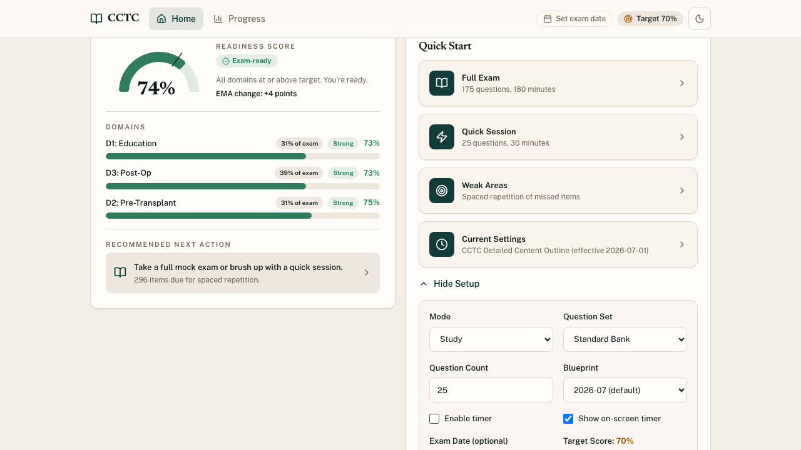
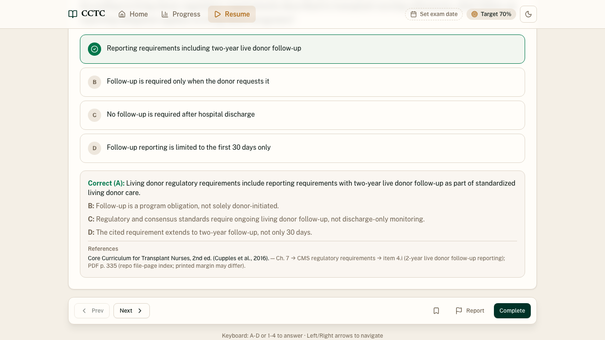
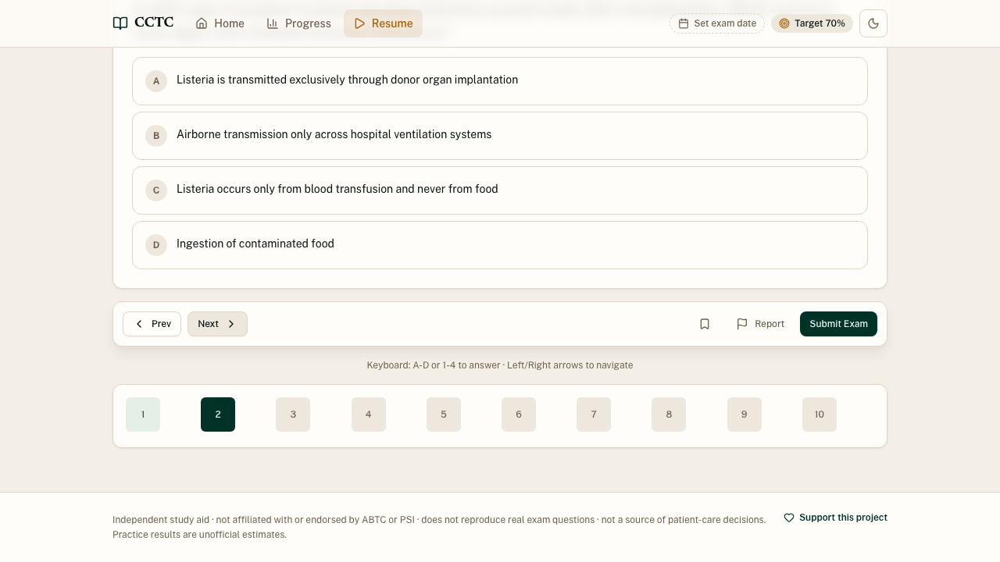
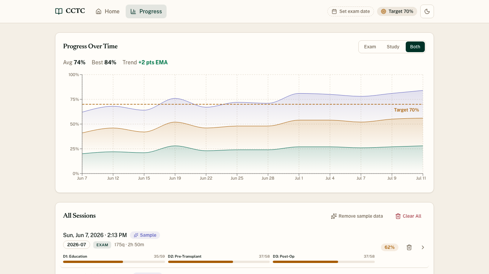
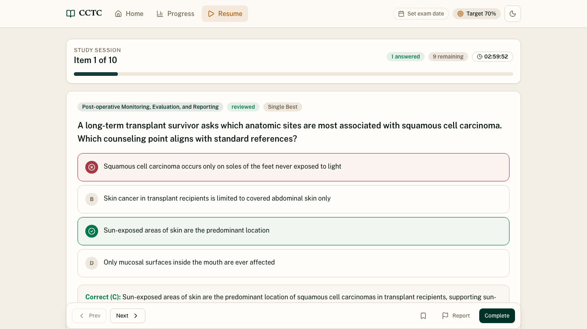
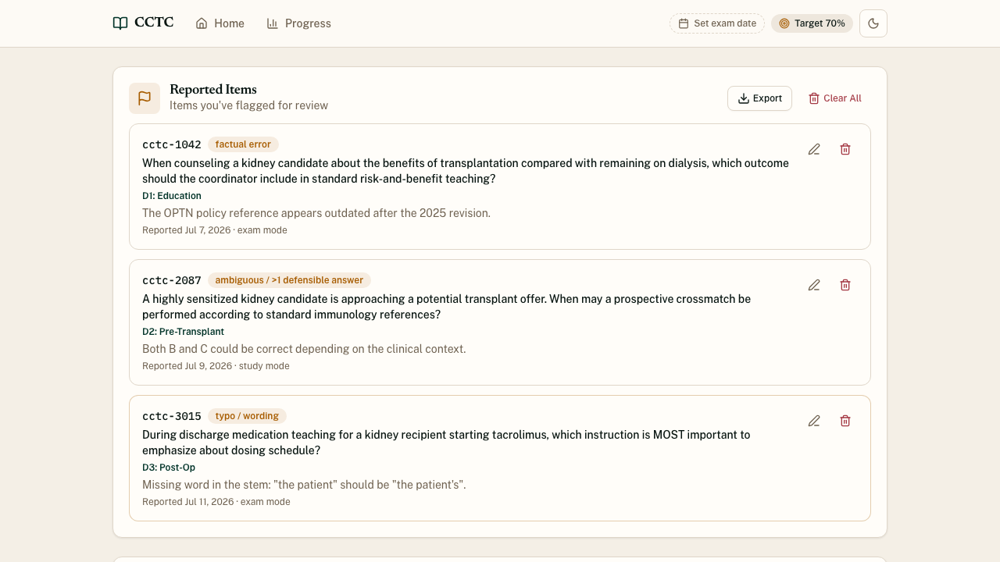

# [CCTC Practice Exam](https://mikejmckinney.github.io/CCTC/)

A private, client-side study app for the ABTC **Certified Clinical Transplant Coordinator (CCTC®)** exam.

> **Independent study aid.** This app is not affiliated with or endorsed by ABTC or PSI, does not reproduce real exam questions, and is not a source of patient-care decisions. Practice scores are unofficial estimates.

[00-hero-overview.mp4](https://github.com/user-attachments/assets/ebc4ea29-28c9-4717-bdf4-1bc1303d57b7)

<p align="center">
  <a href="https://github.com/user-attachments/assets/ebc4ea29-28c9-4717-bdf4-1bc1303d57b7"></a>
</p>

<p align="center"><a href="https://mikejmckinney.github.io/CCTC/"><strong>Open the live app</strong></a></p>

## What it does

- Builds **Study** or **Exam** sessions from 506 reviewed, original practice items.
- Supports the current 2026-07 blueprint and the legacy outline ending 2026-06.
- Samples by blueprint weight, randomizes questions and answers, and de-prioritizes recently seen items.
- Saves after every answer in IndexedDB and resumes unfinished sessions exactly where they stopped.
- Offers keyboard answering with `A-D` or `1-4`, plus Left/Right question navigation.
- Tracks positional session progress, bookmarks, unanswered items, and reported-item context.
- Calculates readiness from **Exam sessions only** using an exponential moving average (EMA).
- Resurfaces Study misses through weak-area and spaced-repetition practice without changing readiness.
- Shows per-domain trends and full session records on desktop and mobile.
- Supports export/import backups and optional synchronization through a cloud-synced folder.
- Runs entirely in the browser with no account, backend, or runtime model calls.

## Feature tour

<table>
  <tr>
    <td align="center" valign="top" width="33%">
      <h3>Dashboard &amp; setup</h3>
      <a href="https://github.com/user-attachments/assets/8dfbeb6a-be3b-4832-b2b7-fe595f71cbbd"></a>
      <p>Start immediately or customize mode, question set, count, blueprint, timer, exam date, and target score.</p>
    </td>
    <td align="center" valign="top" width="33%">
      <h3>Study explanations</h3>
      <a href="https://github.com/user-attachments/assets/430d014a-65f7-4c67-b83c-07f9200ca841"></a>
      <p>Reveal the correct answer, rationale for every option, and references immediately after answering.</p>
    </td>
    <td align="center" valign="top" width="33%">
      <h3>Exam controls</h3>
      <a href="https://github.com/user-attachments/assets/02670582-828c-4d9f-be3e-ce124b89dbd2"></a>
      <p>Navigate by mouse or keyboard, bookmark questions, report issues, and keep explanations hidden until submit.</p>
    </td>
  </tr>
  <tr>
    <td align="center" valign="top" width="33%">
      <h3>Progress</h3>
      <a href="https://github.com/user-attachments/assets/810424d2-516f-46b3-8556-07bbc4196d41"></a>
      <p>Review Exam-only readiness, combined history, EMA change, target performance, and per-domain records.</p>
    </td>
    <td align="center" valign="top" width="33%">
      <h3>Reliable resume</h3>
      <a href="https://github.com/user-attachments/assets/ec8a8f18-bcd5-4cce-abc1-93dc4f35ede2"></a>
      <p>Leave and return without losing item order, answers, bookmarks, timer state, or current position.</p>
    </td>
    <td align="center" valign="top" width="33%">
      <h3>Backup &amp; reporting</h3>
      <a href="https://github.com/user-attachments/assets/c5f14614-586b-4e4e-8387-95dcb01eabfb"></a>
      <p>Move progress between devices, maintain a reported-item queue, and export reports for review.</p>
    </td>
  </tr>
</table>

<details>
<summary><strong>Watch feature demos</strong></summary>

### Dashboard and setup

<p align="center"><video src="https://github.com/user-attachments/assets/8dfbeb6a-be3b-4832-b2b7-fe595f71cbbd" controls muted playsinline width="960" aria-label="Dashboard and custom session setup demonstration"></video></p>

### Study explanations

<p align="center"><video src="https://github.com/user-attachments/assets/430d014a-65f7-4c67-b83c-07f9200ca841" controls muted playsinline width="960" aria-label="Study mode answer explanation demonstration"></video></p>

### Exam controls

<p align="center"><video src="https://github.com/user-attachments/assets/02670582-828c-4d9f-be3e-ce124b89dbd2" controls muted playsinline width="960" aria-label="Exam navigation and reported-item demonstration"></video></p>

### Progress

<p align="center"><video src="https://github.com/user-attachments/assets/810424d2-516f-46b3-8556-07bbc4196d41" controls muted playsinline width="960" aria-label="Progress trends and session records demonstration"></video></p>

### Resume

<p align="center"><video src="https://github.com/user-attachments/assets/ec8a8f18-bcd5-4cce-abc1-93dc4f35ede2" controls muted playsinline width="960" aria-label="Saved session resume demonstration"></video></p>

### Backup and reported items

<p align="center"><video src="https://github.com/user-attachments/assets/c5f14614-586b-4e4e-8387-95dcb01eabfb" controls muted playsinline width="960" aria-label="Backup and reported-item management demonstration"></video></p>

</details>

## Readiness and practice model

Readiness is an EMA of completed **Exam** session scores (`alpha = 0.3`), so recent performance matters more without allowing one result to dominate. Study sessions are excluded because immediate feedback does not estimate closed-book exam performance. Incorrect Study answers still enter the weak-area and spaced-repetition queue.

Results are raw practice percentages. The app does not calculate ABTC scaled scores or an official cut score.

## Privacy and storage

- Progress stays in the browser's IndexedDB by default.
- There is no account, analytics service, application backend, or runtime AI call.
- Manual JSON export/import moves history, flags, settings, and an active session.
- Browsers supporting the File System Access API can sync through a user-selected Google Drive, OneDrive, or iCloud folder.

## Local development

```bash
npm install
npm run dev
```

Useful checks:

```bash
npm test
npm run build:ci
CI=true npm run test:e2e:playwright
```

The Vite app is static-hostable. GitHub Pages builds use `VITE_BASE_PATH=/CCTC/` and publish `dist/` through `.github/workflows/deploy-pages.yml`.

## Repository layout

```text
src/
  app/App.tsx             Application composition, routing, persistence, and sync
  components/             Navigation, theme provider, and reusable UI primitives
  lib/                    Session assembly, scoring, readiness, backup, and navigation
  pages/                  Dashboard, Session, Review, History, and Reported Items
questions/                Reviewed and draft item-bank shards by blueprint domain
blueprints/               Current and legacy CCTC content-outline configuration
schema/                   Question-bank JSON schema
e2e/                      Playwright behavior and responsive-layout coverage
scripts/                  Validation, references, coverage, and E2E orchestration
docs/media/readme-demos/  Reproducible README capture, poster, and media workflow
.github/workflows/        Validation, tests, deployment, and repository automation
```

## Content and design decisions

- **One bank, multiple blueprints.** Items use the current domain/task taxonomy; legacy sections come from a blueprint crosswalk rather than duplicate tagging.
- **Structured, reviewed JSON.** Sharded files are schema-validated and remain easy to review in Git.
- **Grounded original questions.** Public and authoritative sources support original practice content. Owned reference texts verify facts but are not reproduced.
- **Human review gate.** New items begin as drafts and require SME promotion to `reviewed`.
- **No backend question generation.** Model-assisted authoring occurs offline; learners receive static reviewed content.

Blueprint data comes from the ABTC Candidate Handbook revised March 12, 2026. The published exam format is 175 items (150 scored and 25 unscored pretest items) in three hours.

## Current status

The production app on `main` includes the complete practice engine, 506 reviewed standard items plus scenario companions, current and legacy blueprints, responsive Warm Professional interface, light/dark modes, Exam-only readiness, Study weak-area review, keyboard controls, reported items, local persistence, backup, and folder synchronization.

- **Live app:** https://mikejmckinney.github.io/CCTC/
- **FAQ:** [docs/FAQ.md](docs/FAQ.md)
- **Question authoring:** [questions/README.md](questions/README.md)

## Limitations and roadmap

- Practice results are unofficial estimates, not ABTC scaled scores or pass/fail decisions.
- This is an exam-preparation tool, not medical advice.
- Browser capabilities vary; folder synchronization requires the File System Access API, while JSON export/import remains available elsewhere.
- Planned work includes deeper reference links and improved organ-balance coverage. See [`.context/vision/v2-roadmap.md`](.context/vision/v2-roadmap.md).

<p align="center"><a href="https://donate.stripe.com/dRm9AMcYs0sa2F8dNQ18c00">Support this independent project</a></p>
